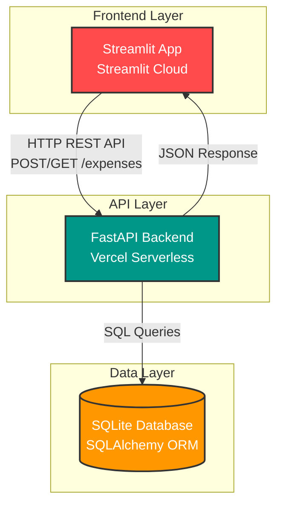

# Expense Tracker

A full-stack expense tracking application built with **FastAPI** (backend) and **Streamlit** (frontend). Record and review personal expenses with filtering, sorting, and category-based analytics.

## Features

- Create expense entries (amount, category, description, date)
- View and filter expenses by category
- Sort expenses by date (newest first)
- Calculate total expenses for filtered results
- Category-wise expense summary with visualizations
- Idempotent API (handles duplicate requests gracefully)
- Input validation and error handling

## Tech Stack

- **Backend**: FastAPI (Python)
- **Frontend**: Streamlit (Python)
- **Database**: SQLite with SQLAlchemy ORM
- **Deployment**: Vercel (Backend), Streamlit Cloud (Frontend)

## Architecture



### Component Overview

**Frontend (Streamlit)**
- User interface for expense management
- Form validation and error handling
- Real-time data visualization
- Deployed on Streamlit Cloud

**Backend (FastAPI)**
- RESTful API endpoints
- Request validation and idempotency
- Business logic and data processing
- Deployed on Vercel serverless functions

**Database (SQLite)**
- Persistent storage for expenses
- ACID-compliant transactions
- Managed via SQLAlchemy ORM

## Prerequisites

- Python 3.8+
- pip

## Quick Start

### Local Development

1. **Clone the repository**
   ```bash
   git clone https://github.com/Rhishi-04/Expense-Tracker-FenmoProject-.git
   cd Expense-Tracker-FenmoProject-
   ```

2. **Install dependencies**
   ```bash
   pip install -r requirements.txt
   ```

3. **Start the backend**
   ```bash
   uvicorn app:app --reload --port 8000
   ```

4. **Start the frontend** (in a new terminal)
   ```bash
   streamlit run streamlit_app.py
   ```

5. **Access the application**
   - Frontend: http://localhost:8501
   - Backend API: http://localhost:8000
   - API Docs: http://localhost:8000/docs

## API Endpoints

### POST /expenses
Create a new expense entry.

**Request:**
```json
{
  "amount": "100.50",
  "category": "Food",
  "description": "Lunch",
  "date": "2024-01-15"
}
```

### GET /expenses
Get list of expenses with optional filters.

**Query Parameters:**
- `category` (optional): Filter by category
- `sort` (optional): Use `date_desc` for newest first

**Examples:**
```bash
GET /expenses
GET /expenses?category=Food
GET /expenses?sort=date_desc
GET /expenses?category=Food&sort=date_desc
```

## Deployment

### Backend (Vercel)

The backend is deployed on Vercel and automatically deploys on push to `main` branch.

**Production URL:** `https://expense-tracker-api-lemon-nu.vercel.app`

### Frontend (Streamlit Cloud)

1. Go to [share.streamlit.io](https://share.streamlit.io)
2. Connect your GitHub repository
3. Set main file: `streamlit_app.py`
4. Add secret in Settings → Secrets:
   ```toml
   API_URL = "https://expense-tracker-api-lemon-nu.vercel.app"
   ```
5. Deploy

## Database

- **Type**: SQLite
- **Location**: `/tmp/expenses.db` (serverless) or `./expenses.db` (local)
- **Note**: Data is ephemeral on Vercel serverless functions

## Design Decisions

- **Decimal for Money**: Uses Python `Decimal` and SQL `Numeric(10,2)` for precise financial calculations
- **Idempotency**: Request hashing prevents duplicate expenses from retries
- **Error Handling**: Comprehensive error handling for network failures and edge cases
- **SQLite**: Chosen for simplicity and zero configuration

## Project Structure

```
├── app.py                 # FastAPI backend
├── streamlit_app.py      # Streamlit frontend
├── requirements.txt       # Python dependencies
├── vercel.json           # Vercel deployment config
└── README.md             # Documentation
```

## Links

- **GitHub Repository**: https://github.com/Rhishi-04/Expense-Tracker-FenmoProject-
- **Backend API**: https://expense-tracker-api-lemon-nu.vercel.app
- **API Documentation**: https://expense-tracker-api-lemon-nu.vercel.app/docs

## License

MIT License - see [LICENSE](LICENSE) file for details.

---

Built with FastAPI and Streamlit
